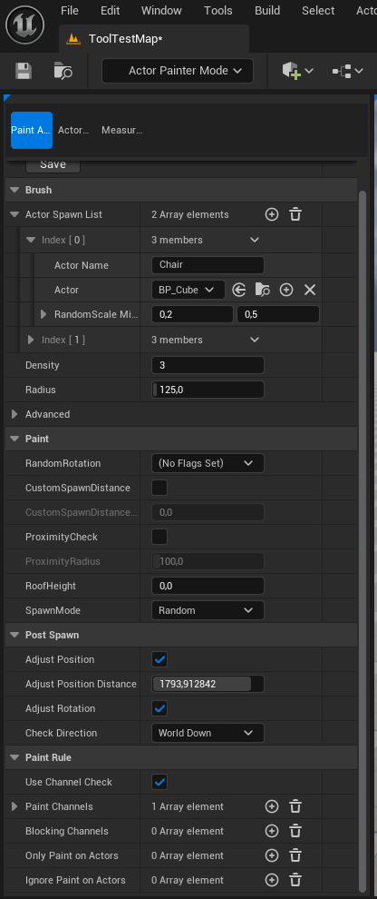
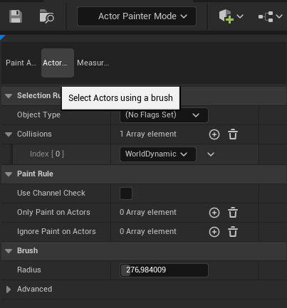

# UE5 Actor Paint Tool [WIP]

Unreal Engine 5 editor tool. Not Stable. Not finished.

Easily add or select groups of actors to a level with a single movement.
- Simple keyboard shortcuts
- Random rotation and position
- Random selection within a pool
- Undo with ctrl-z
- Adjust position and rotation with normal
- Selection mode
- and more

# Preview Paint Mode

# Preview Selection Mode

